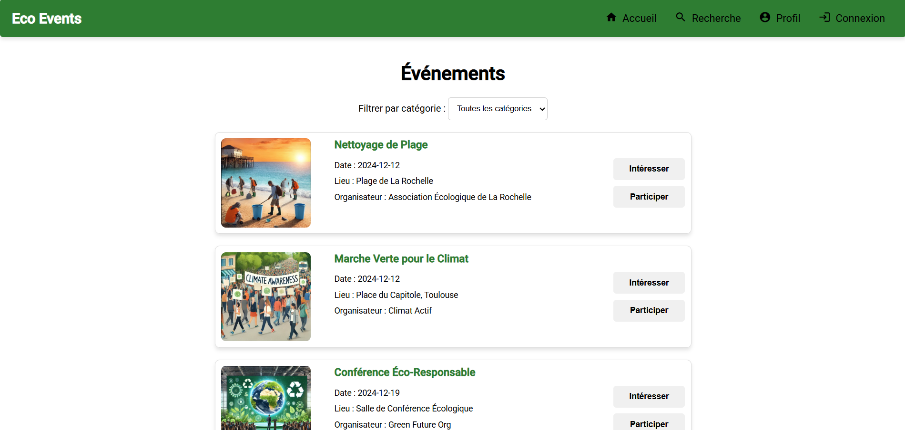
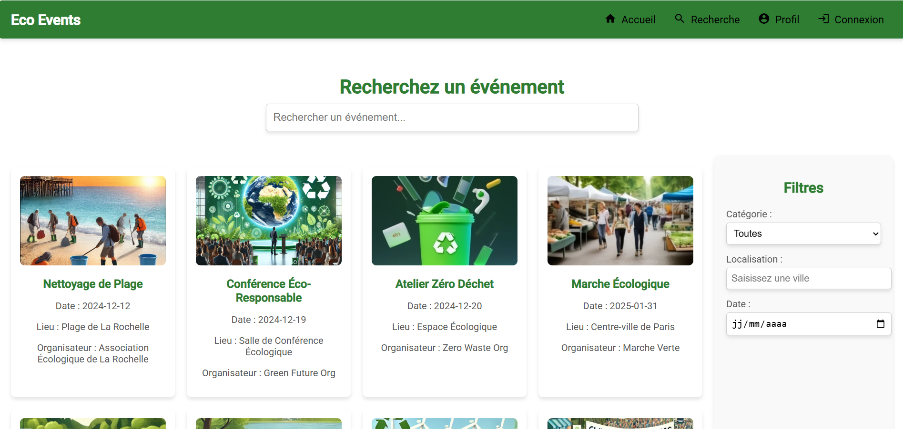
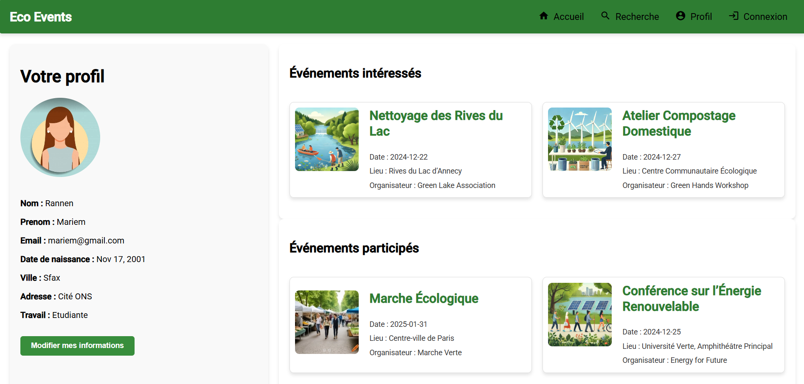

# 🌿 Eco Events  

## 📝 Description  
**Eco Events** est une application web développée avec **Angular** permettant de découvrir et gérer des **événements écoresponsables** (ateliers, conférences, actions écologiques, etc.).  
Ce projet met l’accent sur une interface moderne, adaptative et ergonomique pour faciliter la navigation et la découverte d’événements durables.  

---

## 🚀 Fonctionnalités principales  
- 🔍 Affichage et filtrage des événements écoresponsables  
- 🧭 Navigation entre les pages via Angular Router  
- 🧩 Composants réutilisables et architecture modulaire  
- 📱 Interface adaptative pour mobile et desktop  
- 🔒 Début d’implémentation d’un module d’authentification (en cours d’amélioration)  

---

## 🛠️ Technologies utilisées  
- **Framework :** Angular  
- **Langage :** TypeScript  
- **Markup / Style :** HTML, CSS  
- **Outils :** Node.js, Angular CLI  

---
## 🖼️ Aperçu de l’application  

### 🏠 Page d’accueil  

### 🔍 Page de recherche  

### 👤 Page de profil utilisateur  

## 💡 Améliorations prévues
- Finalisation de l’authentification (inscription / connexion)
- Intégration d’une base de données pour la gestion des événements
